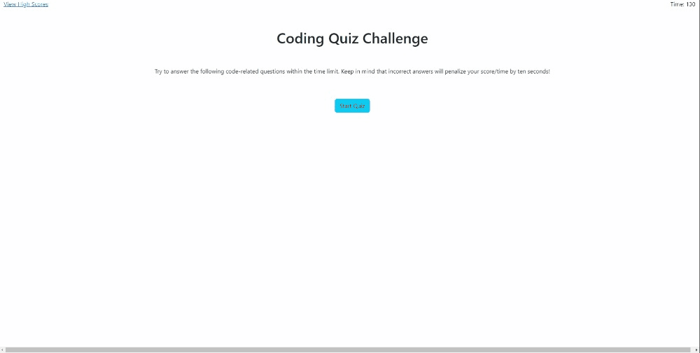

# 04 Web APIs: Code Quiz

## Description 

This is a javascript timed quiz. When pressing start the timer begins a question appears. Every time a question is answered by selecting with the users cursor, then a display pops up showing if the question was answered correctly or not and proceeds to the next question.
If a question is answered incorrectly, then the timer subtracts 10 seconds as a penalty. When all questions are answered or the timer reaches 0, then the quiz is over and the user is prompted to enter their initials with their displayed final score.
The user can select the high score screen at the start of the quiz again to view all high scores.

## Link and preview

https://hculp.github.io/timed-quiz/

